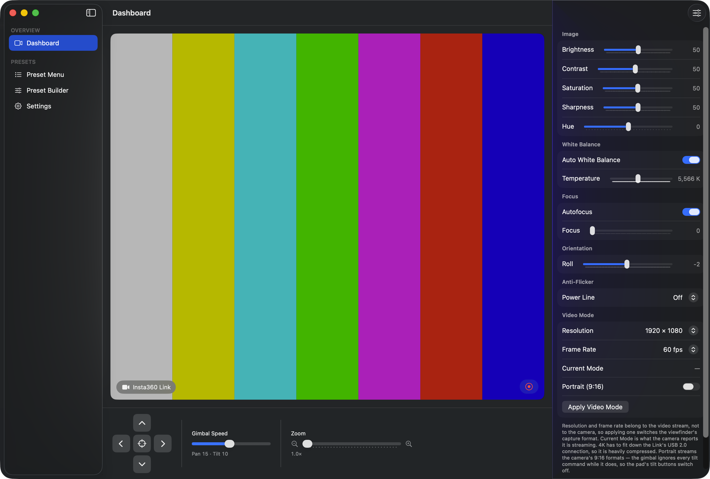
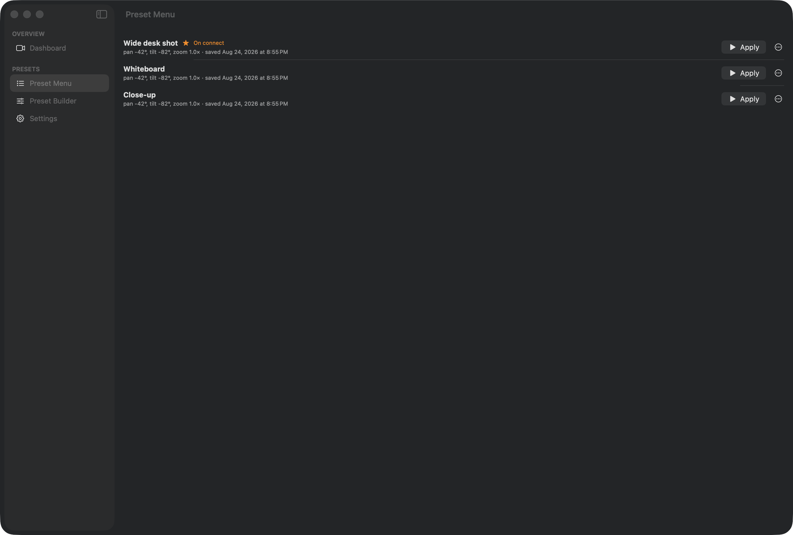
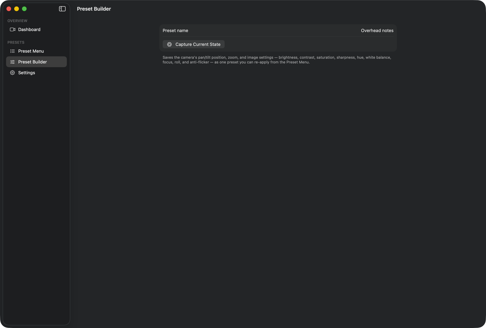
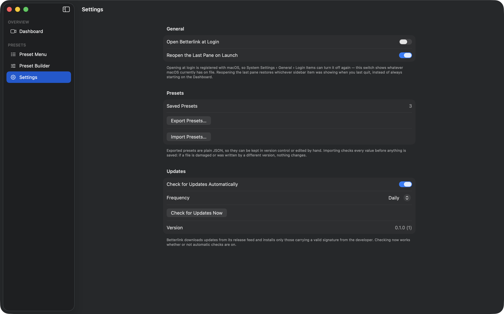

# Betterlink

A native macOS controller for the Insta360 Link webcam — a substitute for the
first-party Insta360 Link Controller app.

[](https://github.com/jfwoods/betterlink/releases/latest)
[](https://github.com/jfwoods/betterlink/releases/latest)
[](https://github.com/jfwoods/betterlink/actions/workflows/ci.yml)
[](#requirements)
[](https://swift.org)



> The viewfinder above shows color bars because the screenshots are captured
> with a stand-in pattern. In use it is a live preview of the camera.

## What it does

Betterlink talks to the Link two ways at once: USB control transfers for the
camera's own settings (gimbal, zoom, image parameters) and an AVFoundation
capture session for the picture. The viewfinder is the center of the window,
with the controls arranged around it.

- **Live viewfinder.** The Link is found automatically by USB VID `0x2E1A` /
  PID `0x4C01`, falling back to any external camera. Connect and disconnect are
  handled while the app runs — no relaunch.
- **Gimbal control.** A press-and-hold pan/tilt pad with a guaranteed stop on
  release, a center button, and a speed slider scaled into the camera's pan
  0–30 / tilt 0–20 range.
- **Zoom.** 1.0×–4.0×, from the slider or by scrolling over the live preview.
- **Image adjustments.** Brightness, contrast, saturation, sharpness, hue,
  white balance (auto or 2000–10000 K), focus (auto or manual), roll, and
  anti-flicker. Ranges are read from the camera itself on connect, not
  hard-coded.
- **Resolution and frame rate.** Built from the formats the camera advertises —
  720p60, 1080p60 and 4K30 all work — plus an optional portrait (9:16) mode.
- **Recording.** Start/stop over the viewfinder with an elapsed-time readout.
  Records to a timestamped `.mov` in `~/Movies` and reveals it in Finder when it
  finishes. Audio prefers the Link's own microphone.
- **Presets.** One named snapshot of position, zoom, and every image parameter,
  re-applied in a click — and exportable, so a set of shots moves to another Mac.
- **Automatic updates** through Sparkle, signed and notarized by the release
  pipeline.

## Presets

A preset is a single snapshot — pan/tilt position, zoom, brightness, contrast,
saturation, sharpness, hue, white balance, focus, roll, and anti-flicker —
captured from the camera and restored together. They are stored as JSON in
`~/Library/Application Support/Betterlink/presets.json`.

| Preset Menu | Preset Builder |
| --- | --- |
|  |  |

Capture is all-or-nothing: if any value can't be read, no preset is saved.
Restore is deliberately forgiving — individual controls are allowed to fail and
the failures are reported in a banner rather than an alert.

### Moving presets between machines

Settings → Presets exports every saved preset to a versioned JSON wrapper:

```json
{ "format": "betterlink.presets", "version": 1, "exportedAt": "…", "presets": [ … ] }
```

It's plain JSON with sorted keys, so it diffs cleanly and can be kept in version
control or edited by hand. Import validates the entire file before the store is
touched — format marker, exact version, duplicate identifiers, blank names, and
every value against the range the camera accepts — so a damaged or foreign file
changes nothing at all.

A valid file then offers **Merge** or **Replace All**. Merge skips presets you
already have, matched by identifier. An imported "Apply on Connect" mark never
displaces one you set yourself, but it will fill the slot if you haven't set
one, and the summary tells you when that happened.

## Settings



Settings is a sidebar pane rather than a separate window — there is no ⌘,
shortcut. Three sections:

**General.** "Open Betterlink at Login" reads the live `SMAppService`
registration instead of a stored preference, so it shows what macOS actually has
on file and follows changes you make in System Settings › General › Login Items.
If macOS wants approval, an "Approval Needed" row appears with a button through
to that pane. "Reopen the Last Pane on Launch" is on by default — the ordinary
Mac behavior — and turning it off makes the app always start on the Dashboard.
The last-used pane is recorded on every navigation whether or not the preference
is on, so switching it on later has something real to restore.

**Presets.** A saved-preset count, and the export/import described above.

**Updates.** An automatic-check toggle, an Hourly / Daily / Weekly frequency
picker, "Check for Updates Now" (which works whether or not automatic checks are
on), and the running version and build number.

## Requirements

- macOS 26 or later
- An Insta360 Link connected over USB
- Camera permission (and microphone permission, if you want audio on recordings)

No admin rights and no kernel extension. Betterlink reaches the camera through
endpoint-zero control transfers on the device-level IOKit user client and never
claims the video interfaces, so it coexists with macOS's own `UVCAssistant` and
with whatever app is using the camera as a webcam.

## Install

Download the latest `.dmg` from
[Releases](https://github.com/jfwoods/betterlink/releases/latest) and drag
Betterlink to Applications. Builds are Developer ID signed, notarized, and
stapled, so they open without a Gatekeeper detour.

After the first launch the app checks for updates automatically (on launch and
every 24 hours), or on demand from **Betterlink → Check for Updates…**.

## Building from source

The Xcode project is generated, not committed.

```sh
brew install xcodegen
xcodegen generate
open Betterlink.xcodeproj
```

Or from the command line:

```sh
xcodebuild -project Betterlink.xcodeproj -scheme Betterlink \
  -configuration Debug -destination 'platform=macOS' build
```

Sparkle 2.x is the only dependency, resolved through SPM.

Local builds sign with a Developer ID identity rather than ad-hoc. That is
deliberate: macOS stores a code requirement alongside each camera and
microphone grant, and an ad-hoc signature's requirement pins the code hash —
which changes on every build — so every rebuild presents itself to the system
as a different app. A Developer ID requirement is team-based and stays
identical across rebuilds, so the grant keeps matching. CI and the release
workflow both override `CODE_SIGN_IDENTITY` on the `xcodebuild` command line,
so signed and notarized output is unaffected.

The first local build on a new machine raises a keychain authorization dialog
("codesign wants to sign using key … in your keychain"). Answer it with
**Always Allow**. Until it is answered `codesign` waits indefinitely, and
builds in any other worktree fail with a misleading `unable to attach DB …
database is locked`.

## Known limits

Honest list of what this does not do yet:

- **"Apply on Connect"** persists on a preset and shows in the list, but
  nothing applies it on connect yet — the device-connection hook is still to
  come.
- **No exposure, ISO, or shutter control**, and no HDR or mirror toggles. The
  selector numbers and payload encodings for those are not yet known.
- **No tracking, auto-framing, gesture control, or the first-party view modes**
  (Whiteboard / Overhead / DeskView). Deliberately out of scope.
- **Tilt does not work in portrait.** The camera silently ignores every tilt
  command — relative and absolute — while it streams a 9:16 format, so the pad's
  tilt buttons switch themselves off when portrait is on.
- **4K is heavily compressed.** It has to fit down the Link's USB 2.0 link.
- **Editing a saved preset's values** isn't implemented; re-capture instead.
- **Presets don't wait for the gimbal to arrive.** Restore fires the move and
  returns; settle times are unmeasured.

## Repository layout

| Path | What's in it |
| --- | --- |
| `Sources/Betterlink/Transport/` | USB/UVC control channel — IOKit user client, the `UVCTransport` actor, selector table |
| `Sources/Betterlink/Viewfinder/` | Capture session, device discovery, format selection |
| `Sources/Betterlink/Controls/` | Control state, ranges read from the camera, the write queue |
| `Sources/Betterlink/Dashboard/` | Dashboard, control bar, inspector, scroll-to-zoom |
| `Sources/Betterlink/Presets/` | Preset model, on-disk store, snapshot capture/restore, both preset panes |
| `Sources/Betterlink/Recording/` | Host-side recording controller and its overlay control |
| `Sources/Betterlink/Settings/` | Shared preference keys and the Settings pane |
| `Checks/` | Standalone checks — preset persistence (runs in CI) and a hardware gimbal probe (needs the Link attached) |
| `docs/RELEASING.md` | Cutting a release, and the one-time signing/notarization/Sparkle setup |

## Project documents

- [`CHANGELOG.md`](CHANGELOG.md) — what changed, and why
- [`ROADMAP.md`](ROADMAP.md) — phases, scope decisions, and hardware-verification debts
- [`specifications.md`](specifications.md) — the original requirements
- [`investigation-findings.md`](investigation-findings.md) — the reverse-engineering
  notes on the first-party app and the camera's UVC surface

---

Betterlink is an independent project. It is not affiliated with, endorsed by, or
supported by Insta360 or Arashi Vision.
